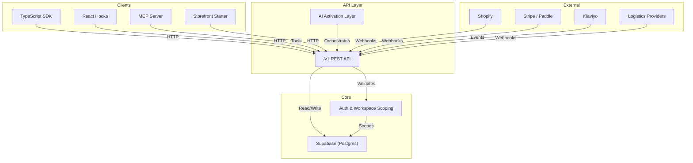
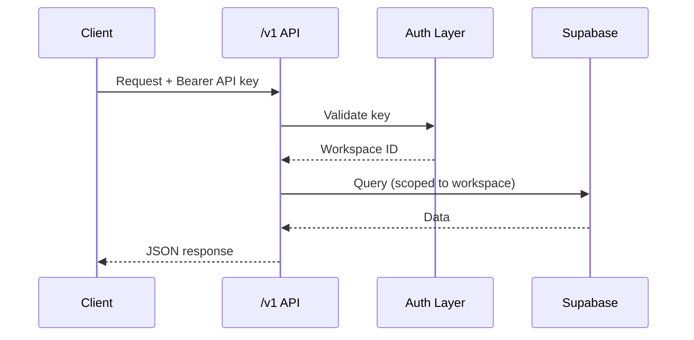

## Overview

Reponse is built on a Next.js application backed by Supabase (Postgres). The REST API under `/v1` is the single integration surface; the TypeScript SDK is generated from the same OpenAPI specification, so the SDK and the API never drift apart.

## Platform Architecture

## Layers

Data lives in Supabase. The `/v1` API exposes it with workspace-scoped authentication. The SDK and React hooks wrap the API. The AI activation layer and MCP server sit on top.

| Layer | Role | Examples |
| --- | --- | --- |
| **Data** | Postgres via Supabase | Products, orders, carts, conversations |
| **API** | REST endpoints under `/v1` | `GET /v1/products`, `POST /v1/carts` |
| **SDK** | TypeScript client + React hooks | `@reponse/sdk`, `useProducts()` |
| **AI** | Activation layer + MCP server | Engine selection, intent classification |
| **Integrations** | External service sync | Shopify, Stripe, Klaviyo, logistics |

## Request Flow

## Multi-tenancy

Every resource is scoped to a workspace. Your API key determines the workspace, and the API enforces it on every query. There is no cross-workspace data access — isolation is enforced at the database level.
