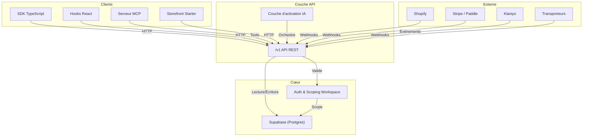
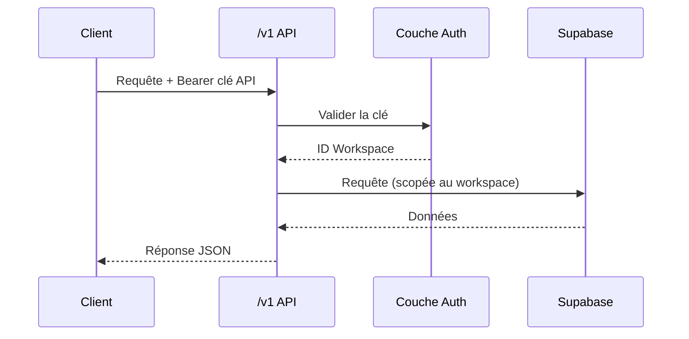

## Vue d'ensemble

Reponse repose sur une application Next.js adossée à Supabase (Postgres). L'API REST sous `/v1` est la surface d'intégration unique ; le SDK TypeScript est généré depuis la même spécification OpenAPI, donc le SDK et l'API ne divergent jamais.

## Architecture de la plateforme

## Couches

Les données vivent dans Supabase. L'API `/v1` les expose avec une authentification liée au workspace. Le SDK et les hooks React enveloppent l'API. La couche d'activation IA et le serveur MCP se posent au-dessus.

| Couche | Rôle | Exemples |
| --- | --- | --- |
| **Données** | Postgres via Supabase | Produits, commandes, paniers, conversations |
| **API** | Endpoints REST sous `/v1` | `GET /v1/products`, `POST /v1/carts` |
| **SDK** | Client TypeScript + hooks React | `@reponse/sdk`, `useProducts()` |
| **IA** | Couche d'activation + serveur MCP | Sélection d'engine, classification d'intent |
| **Intégrations** | Synchronisation services externes | Shopify, Stripe, Klaviyo, transporteurs |

## Flux d'une requête

## Multi-tenant

Chaque ressource est liée à un workspace. Votre clé API détermine le workspace, et l'API l'applique sur chaque requête. Il n'y a pas d'accès inter-workspace — l'isolation est appliquée au niveau de la base de données.
